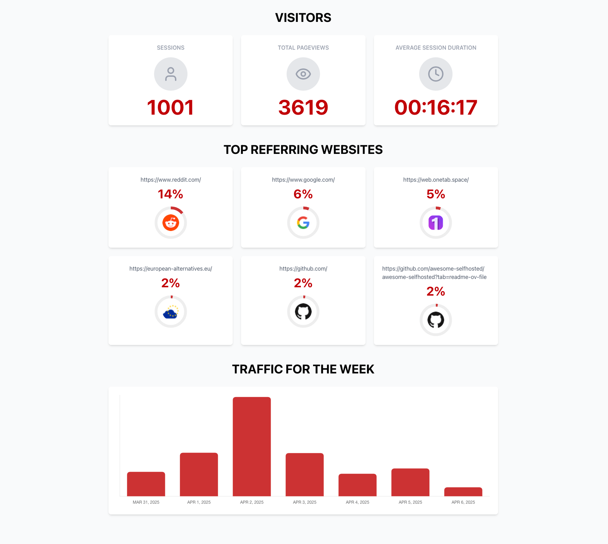

# Swetrix Analytics API Custom Dashboard

This is a simple dashboard application that displays analytics data from Swetrix Analytics API. It includes:

- Visitor statistics (sessions, pagesviews, session duration)
- Top referring websites
- Weekly traffic data

It uses [/v1/log](https://docs.swetrix.com/statistics-api#get-v1log) and [/v1/log/birdseye](https://docs.swetrix.com/statistics-api#get-v1logbirdseye) endpoints to fetch data.



## Getting Started

To get started with this dashboard, follow these steps:

1. Clone the repository
2. Navigate to the project directory
3. Install dependencies

```bash
npm install
```

4. Start the development server

```bash
npm run dev
```

5. Open your browser and navigate to the URL shown in the terminal

## API Information

This dashboard uses the Swetrix API to fetch data for our live stats (public) project with ID `STEzHcB1rALV`.

For more information about the Swetrix Analytics API, visit the [documentation](https://docs.swetrix.com/statistics-api).
